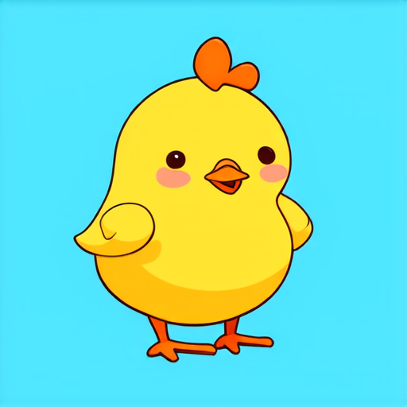
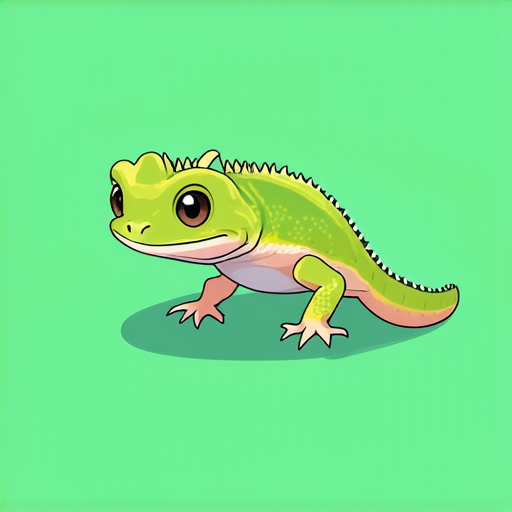
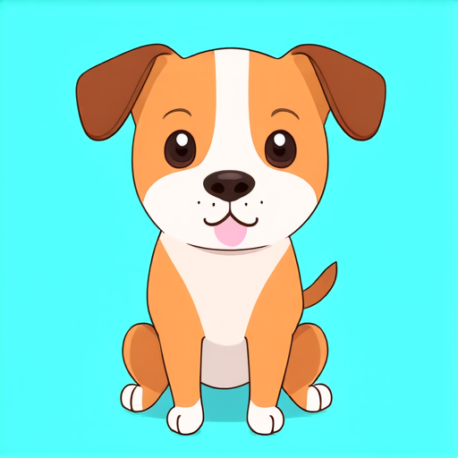
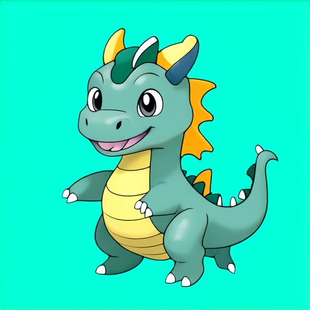
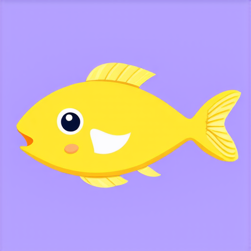
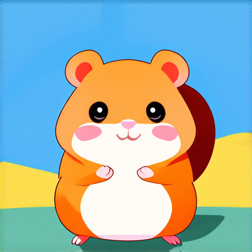

# Image Generation with DDPM

This project develops a diffusion-based generative model to synthesize 64×64 RGB images of cute animals from random noise. The model is trained on a synthetic dataset of 22,000 images spanning 11 animal classes, generated using Stable Diffusion 3 Medium. A Denoising Diffusion Probabilistic Model (DDPM) with a custom UNet architecture is implemented using the Hugging Face Diffusers library to learn the reverse diffusion process and progressively reconstruct realistic images from noisy inputs. Training is optimized with mixed-precision computation, gradient checkpointing, and EMA to improve stability and sample quality, while DDIM sampling enables faster image generation during inference.

<table align="center">
  <tr>
    <td></td>
    <td></td>
    <td></td>
  </tr>
  <tr>
    <td></td>
    <td></td>
    <td></td>
  </tr>
</table>

## Course

DS 542 Deep Learning with Data Science - Boston University
